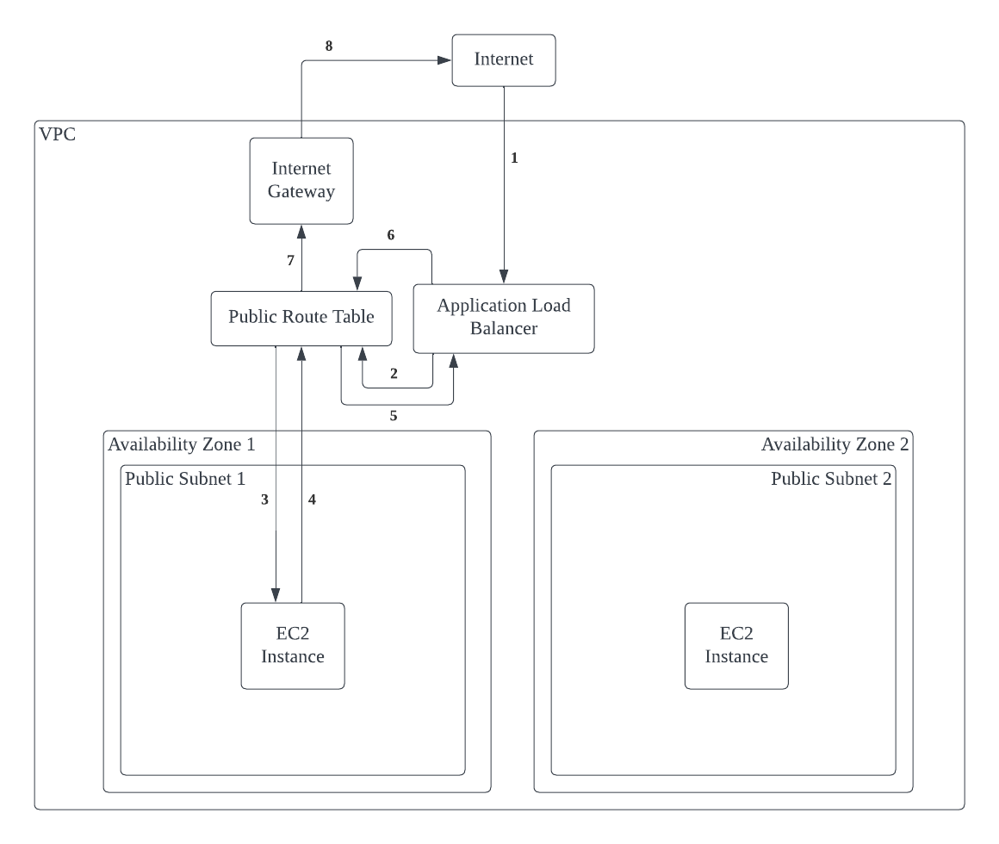
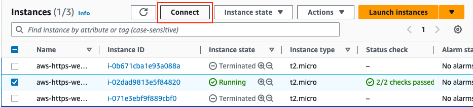
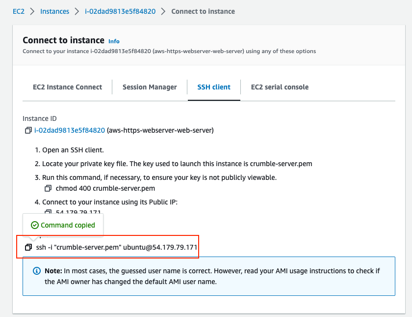

### aws-https-webserver-template

---

**Table of Contents**

<div id="user-content-toc">
  <ul>
    <li><a href="#1-why">1. Why</a>
      <ul>
        <li><a href="#11-required-knowledge">1.1 Required Knowledge</a></li>
      </ul>
    </li>
    <li><a href="#2-goals">2. Goals</a></li>
    <li><a href="#3-overview">3. Overview</a></li>
    <li><a href="#4-prerequisite-set-up">4. Prerequisite Set Up</a>
      <ul>
        <li><a href="#41-register-a-domain-name-with-aws-on-route-53">4.1. Register a domain name with AWS on Route 53</a></li>
        <li><a href="#42-enable-ssh-access-into-your-ec2-instances">4.2. Enable SSH access into your ec2 instances</a></li>
        <li><a href="#43-get-aws-credentials-to-run-terraform">4.3. Get AWS Credentials to run Terraform</a></li>
      </ul>
    </li>
    <li><a href="#5-creating-the-aws-resouces-with-terraform">5. Creating AWS Resources with Terraform</a></li>
    <li><a href="#6-debugging-your-ec2-instance">6. Debugging your ec2 instances</a></li>
  </ul>
</div>

## 1. Why?
When working on side projects, I used to deploy my back end services on heroku. Well, heroku [removed their free tier](https://help.heroku.com/RSBRUH58/removal-of-heroku-free-product-plans-faq) on November 28, 2022. I recently tried using [render](https://render.com/) but for some reason my backend does not work as expected. And well, they have cold starts.  

So I thought: Heck, let me run my own server.

---

### 1.1 Required Knowledge
- Terraform (to understand the syntax)
    - or you can get an intro [here](https://developer.hashicorp.com/terraform/tutorials/aws-get-started)
- Docker (used to simplify deployment of services)
    - or you can get an intro [here](https://docs.docker.com/get-started/)
- Brief knowledge of AWS 
    - or you can get an intro with my guide on [medium](https://medium.com/@xfated/deploying-a-https-web-server-on-amazon-with-terraform-a03f45d0c898)

## 2. Goals
The goal for this setup: 
- Host a web server on Amazon 
- Enable HTTPS connection because many web clients require you to `load all resources via HTTPS to improve the security of your site`

## 3. Overview
This repo contains the minimum setup (well, the simplest for me at least) to host your own HTTPS web server on Amazon
- An EC2 instance hosts your web server.
- The EC2 instance resides in a VPC.
- An Application Load Balancer routes incoming traffic to your instances.
- Amazon provisions a TSL certificate for your domain name.
- Create a record to map your Load balancer's domain name to your own domain name, enabling HTTPS connections to your services.

Also, we use terraform because its easier to manage your resources. (can start them up or shut them down with just 1 command, instead of going through the AWS console)

### 3.1. Traffic flow
A simplistic view of how traffic is managed in this set up
  
- (1) Client from the internet sends a request to your domain
- (2) The `Application Load Balancer` receives the requests, determines which target to route the traffic to.
- (3) The `Route Table` routes the traffic locally between the load balancer to the ec2 instance
- (4, 5) The `EC2 Instance` returns a response, following the path back the way it came
- (6, 7, 8) The Route Table has a default route pointing to the `Internet Gateway`, which routes traffic back out to the internet

A more detailed traffic routing can be found [here](https://docs.aws.amazon.com/prescriptive-guidance/latest/load-balancer-stickiness/subnets-routing.html), provided by AWS Docs.

### 3.2. Improvements
- The current set up allows us to establish a `HTTPS` connection to your server via your provided domain name through the load balancer, or a `HTTP` connection by direcly accessing the public IP of your ec2 instance. 
    - Makes it easy for testing and development since we can ssh directly with the public IP.
- For the next step, to make it more secure. You can
    1. move your ec2 instances to private subnets
    1. use NAT gateway + private route table to enable internat access for instances in private subnets
    1. add security group rules to only allow traffic from the load balancer. 
    1. Example [youtube video](https://www.youtube.com/watch?v=pfWd-XNRY7c) on setting this up
- Adding NAT tables incur additional costs and more steps, which is why I didn't include it here.

## 4. Prerequisite Set Up
1. Have followed the steps in [rest_server](./rest_server) to create and publish a docker image of your web server to Amazon ECR   
### 4.1. Register a domain name with AWS on Route 53
- Tutorial found [here](https://aws.amazon.com/getting-started/hands-on/get-a-domain/)
### 4.2. Enable SSH access into your ec2 instances
- Create a `key pair` that can be used later for SSH access into your ec2 instance.  
- Tutorial found [here](https://docs.aws.amazon.com/AWSEC2/latest/UserGuide/create-key-pairs.html) 
### 4.3. Get AWS Credentials to run Terraform
1. Create an IAM user to run Terraform, with the following Permissions policies. Tutorial found [here](https://docs.aws.amazon.com/IAM/latest/UserGuide/id_users_create.html). (Disclaimer: we are using AWS managed policies to make it easy to create the resources required for our set up. Do fine tune the permissions according to your needs for production):
    - AmazonEC2ContainerRegistryFullAccess
    - AmazonEC2FullAccess
    - AmazonRoute53FullAccess
    - AWSCertificateManagerFullAccess
    - IAMFullAccess 
1. Create an Access Key under IAM -> Access management -> Users -> Security credentials -> Access keys
1. Get the "Access Key Id" and "Secret Access Key" and set in environment variables using the following commands in your terminal.
    ```bash
    export AWS_ACCESS_KEY_ID=<your ACCESS KEY ID>
    export AWS_SECRET_KEY_ID=<your SECRET KEY ID>
    ```

## 5. Creating the AWS Resouces with Terraform
1. Initialize terraform workspace
    ```bash
    cd terraform
    terraform init
    ```
1. Update values in [locals.tf](./terraform/locals.tf) specific to your project
1. Create resources. (there should be 25 to add)
    ```bash
    terraform apply
    ```

## 6. Debugging your ec2 instance
- Verify if your web server is running on the ec2 instance
    1. ssh into your ec2_instance
        1. cd into the directory with your key-pair.pem obtained from the [key-pair Prequisite step](#42-enable-ssh-access-into-your-ec2-instances) above.
        1. Connect to your ec2 instance: 
        EC2 -> Instances -> Select Instance -> Click `Connect` -> Copy the ssh command
        
        
        1. Run the command in the terminal. (in the directory with your .pem file)
            - In my case, its: 
                ```bash
                ssh -i "crumble-server.pem" ubuntu@54.179.79.171
                ```
    1. run `sudo docker image ls` to check if your image has been successfully pulled
    1. run `sudo docker ps` to check if a docker container for your image is running
    1. query your endpoints to verify if its serving requests. e.g. `curl localhost:80/healthcheck`